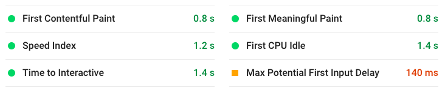
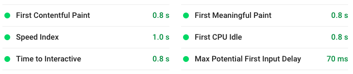
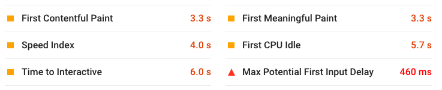
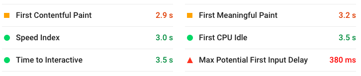

# Legion HQ
Legion HQ is a web-based tool and resource for Fantasy Flight Games: Star Wars: Legion. Legion HQ 2.0 is the improved version of the [Legion HQ](https://github.com/NicholasCBrown/legion-HQ "Legion HQ 1.0 Github").

# Current Major Features
##### Current features in progress
- Fifth Trooper Redesign
- General Code Refactor
- Repo Reorganization
##### Recently finished features
- User authentication & list saving/forking
### List Builder
Users can build lists in standard 800-point format, 1600-point grand army format, and Imperial Discipline's [500-point format](https://imperialdiscipline.blog/2019/06/04/creating-a-500-point-format-for-legion/).

# Planned Major Features
Rough roadmap of features being worked on
### Tournament Organizer
Feature for Tournament Organizers (T.O.'s) to organize events.
- Participants use Legion HQ to build lists and submit them to an event
- Participants submit round results and the software determines next pairing
- Requirements still being gathered...
### Tournament Data Analyzer
Feature built off the Organizer feature that aggregates data for analysis
- Users can query, view, or export data from events
### Card Database
Static pages for each card in the game with various data related to the card:
- Point changes and errata for the card
- Products the card can be acquired in
- Average number of hits, if applicable
- Links to articles from various blogs about the card
- Related cards
### Inventory Manager
Interface for users to input what products or individual cards they own
- Hooks into the list builder to give feedback on what lists can be constructed from collection
### List Rater & Database
Users can publish and share lists they create
- View and rate lists on creativity, fun, competitiveness
- Give feedback in the form of comments
### Soundboard
Feature where user can push buttons to replay sound bytes from Star Wars media
### Custom Card Creator
Feature where user can create a custom unit, upgrade, or command card.
### Custom Card Rater & Database
Users can view custom cards made by other players.
- Give ratings on creativity, design, or balance
- Give feedback in the form of comments
### Mobile & Desktop App
Mobile and desktop apps can be built using a shared codebase with React Native.
- Allows users to use Legion HQ while offline

# Planned Improvements
### Fifth Trooper Redesign
Work In Progress
### Repo Reorganization
Legion HQ will be split into a few different repos.
- Legion-hq-web: Contains all frontend code
- Legion-hq-api: Contains all APIs
- Legion-hq-cards: Small web app for rendering a static page for any card
- Legion-hq-assets: Repo will all other static assets like images, logos, JSON
### General Code Refactor
Code is currently very messy, not maintainable, and not easy to contribute to.
- Decouple app logic and UI logic
- Reduce number of lines in each js file for readability
- more...

# Improvements Over 1.0
- Addition of Republic and Separatists factions
- Serialization of list for sharing URL on social media
- Major redesign of user interface with a focus on mobile browsers
- Moderate code refactor (~780kb -> ~280kb)
- Use of route-based code splitting to decrease initial load time (fully loaded time: 3s -> 1.5s)
- Legion HQ 1.0 Desktop Stats: 

- Legion HQ 2.0 Desktop Stats: 

- Legion HQ 1.0 Mobile Stats: 

- Legion HQ 2.0 Mobile Stats: 

# Technology
Legion HQ's frontend is built in [React](https://reactjs.org/) using Facebook's [create-react-app](https://github.com/facebook/create-react-app) and currently resides in [Heroku](https://dashboard.heroku.com/). The backend database is hosted in [MongoDB Atlas](https://www.mongodb.com/cloud/atlas) and the backend APIs are hosted on a [Lightsail](https://aws.amazon.com/lightsail/) instance.
### Planned Technological Improvements
- Frontend will be served on Amazon S3 buckets behind Cloudfront
- Backend API's will be on Amazon's Lambda functions behind API Gateway
- Frontend and Backend will (probably) be rewritten using Typescript
