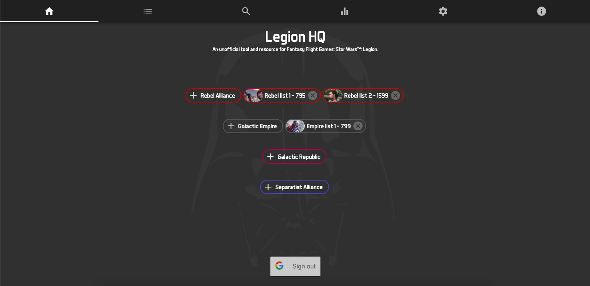
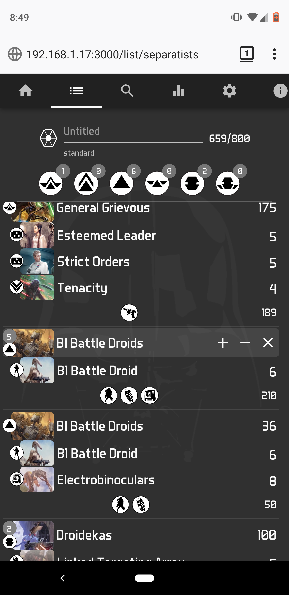
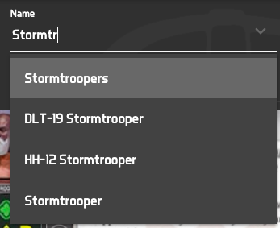
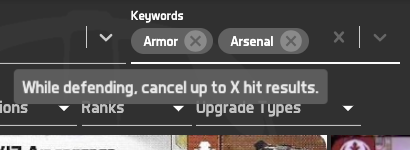
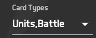
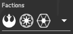
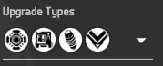

# Legion-HQ 2.0
List builder, inventory manager, and card database for FFG's Star Wars Legion game.

# Pages

## Home: The home page
- Sign in/out using your Google account
- Create a list with one of the four factions
- Load a previously saved list if you're signed in
- Delete a previously saved list if you're signed in
- Saved lists have an icon of the commander of the list (the first one that shows up) and the point total of the list

## List

## Cards: The card database
- Search for cards using various filters

- Search by name of card, with autocomplete!

- Search for cards based on if they include a certain keyword
- Also hover over a keyword to see its definition!

- Search for cards based on their type (units, upgrades, commands, and battle cards)

- Search for cards based on their faction

- Search for cards based on if they are a certain upgrade type

## Stats: Global list statistics

## Settings: Adjust user settings and inventory

## Info: Information about the builder

# Major Changes from 1.0

1. Major refactor of code (~75%)
2. Minor redesign of interface
3. Upgrading Material-UI from ~3.0 to 4.0
4. Move from file based data to 100% database
5. Card Database browser feature
6. Code splitting
7. Image optimization (Convert all PNGs to JPGs)
8. Inventory feature so users can see what they lists they are able to build
9. Suggestion feature that looks at a subset of lists in the database
10. Statistical analysis of units and upgrades (Importing and then integrating a CSV)
11. Mobile app (React Native)
12. Event feature (a la List Fortress for X-Wing)
13. Various QoL features
